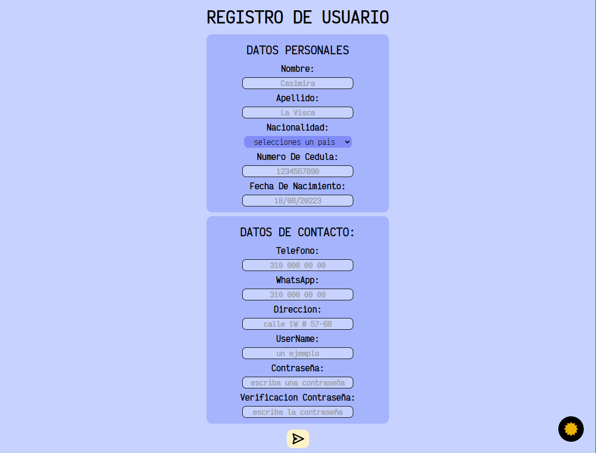
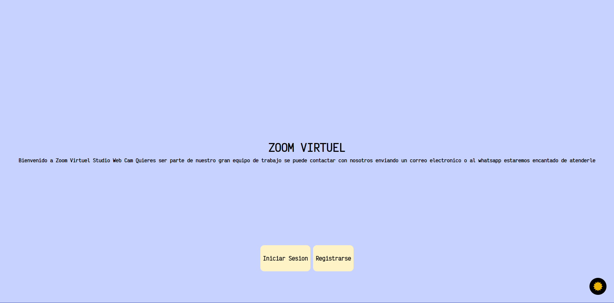
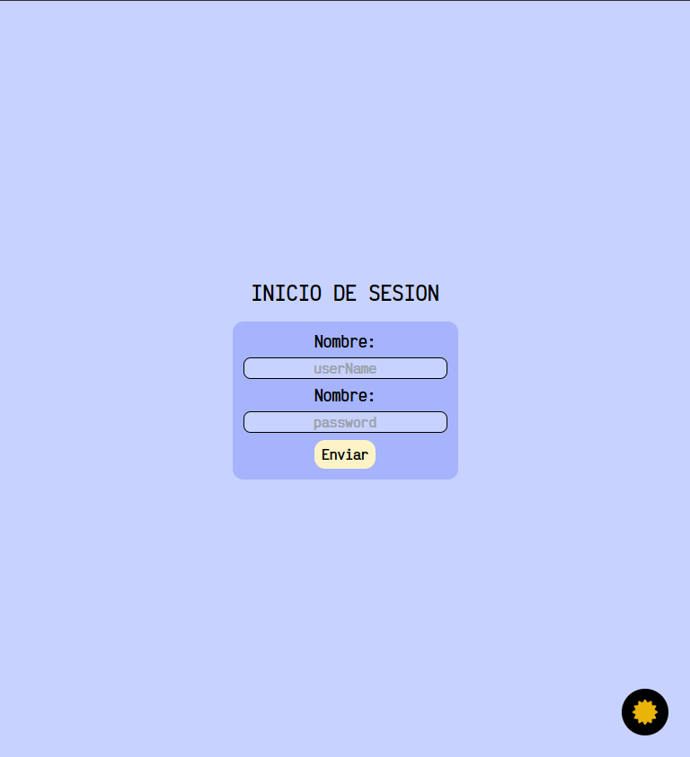

# Documentacion Front-End

1. `npm install` para instalar todas las dependencias.

2. `npm run dev` para correr el front-end en el localhost:5173.

acontinuacion detallo el contenido de cada una de las carpetas presentes en este repositorio

 <details id="componentes">
  <summary> Componentes</summary>
  En esta carpetan encontraremos subcarpetas como editar, paginas, registro, resource y view.

<!--todo carpeta editar -->
<details id="editar">
<summary>editar</summary>
</details>
<!--todo carpeta paginas -->
<details id="paginas">
<summary>paginas</summary>
</details>
<!--todo carpeta registro -->
<details id="registro">
<summary>registro</summary>

<!--? RegisterUser -->
<details id="RegisterUser">
<summary>RegisterUser ("/registro")</summary>
En este componente encontramos todo lo que tiene que ver con el registro de informacion de cualquier usuario que desee entrar en la base de datos de la pagina.



#### `validacion` 
esta funcion verifica cada input del formulario y nos retorna un error segun sea el caso.
primero creamos un objeto llamdo error inicializado como un objeto vacio "{}",
dentro de valida tenemos varios if que comprueban los inputs 
nombre, apellido, sesion verifica que no esten vacios y que su logitud sea mayor a 3 caracteres si no es asi envia un error segun el input que maneja cada validacion,
en nacionalidad solo comprobamos que no este vacio,
en cedula comprobamos que sea mayor a tres numeros y que no sea vacio ademas comprueba que la logitud del numero de cedula sea del formato segun la nacionalidad, 
en la fecha de nacimientos comprobamos primero que no este vacio luego comprobamos que sea mayor de 18 años para poder hacer el registro,
telefono y whatsapp comprobamos que tenga el formato de numeros de telefono de colombia,
en direccion comprobamos que la logitud sea mayor a 10 caracteres y que no sea vacio,
en password comprobamos que sea de minimo 4 caracteres y que no sea vacio y en vefiry verificamos que sean iguales los inputs password y verify por ultimo retornamos el objeto error.
revisar codigo para mas detalle en los comentarios.

#### `RegisterUser` componente funcional.

#### `error`
estado local para el manejo de los errores devueltos por `validacion`.

#### `showForm`
estado local para manejar cuando se debe mostras el formulario se inicializa en ``true``.

#### `showConfirmation`
estado local para manejar la confirmacion de un registro exitoso se inicializa el `false`.

#### `confirmation`
estado local para manejar la confimacion de un registro exitoso el cual muestra un mensaje
`"soy la confirmacion"`.

#### `input`
estado local para manejar los diferentes inputs del formulario se inicializa como un objeto. 

```
{
    nombre: "",
    apellido: "",
    nacionalidad: "",
    cedula: "",
    telefono: "",
    fechaDeNacimiento: "",
    whatsapp: "",
    direccion: "",
    session: "",
    password: "",
    verify: "",
  }
  ```

  #### `useEffect`
  con la funcionalidad o la ejecucion de un action `resetError()` la cual reinicia los errores cuando se monta el componente.

Ahora encontramos los handlers que hacen el manejo de los input y la validacion de errores.
```
ejemplo:
const handleNombre = (event) => {
    setInput({
      ...input,
      nombre: event.target.value,
    });
    setError(
      validacion({
        ...input,
        nombre: event.target.value,
      })
    );
  };
```
de esa forma estan todos los handlers que manejan los inputs ya mensionados en el [`input`](#input).

#### `handleCrear`
se encarga de enviar la informacion del estado [`input`](#input) el servidor siempre y cuando no existan errores en los inputs.

#### useEffect 
en este useEffect se hace el manejo de errores de [`handleCrear`](#handlecrear) si el servidor contesta positivo entonces se cambia [`showConfirmation`](#showconfirmation) a `true` y se muestra [`confirmation`](#confirmation) luego se usa un setTimeout con 2 segundos donde [`confirmation`](#confirmation) se pasa a un string vacio y [`input`](#input) se regresa al estado inicial [`showForm`](#showform) se pasa a `false` para ocultar el formulario en caso de ser negativo la respuesta entonces [`showForm`](#showform) se pasa a `true` y [`showConfirmation`](#showconfirmation) a `false`


</details>

<!--? otro -->
<details>
<summary> ("/")</summary>


</details>

</details>

<!--todo carpeta resource -->
<details>
<summary>resource</summary>

</details>

  <!--todo carpeta view -->
  <details>
  <summary>view</summary>

  <!--? Crear -->
<details>
<summary>Crear ("/crear")</summary>


</details>

<!--? DetailUser -->
<details>
<summary>DetailUser ("/modelo/:id")</summary>


</details>

<!--? Home -->
<details>
<summary>Home ("/home")</summary>


</details>

<!--? Loading -->
<details>
<summary>Loading ("/loader")</summary>


</details>
  <!--? componente login -->

  <details>
  <summary>Login ('/') </summary>
  En este componente encontramos el titulo de la empresa y una descripcion de la misma y   los botones para el inicio de sesion y registro.

  
</details>

<!--? Modelos -->
<details>
<summary>Modelos ("/modelos")</summary>


</details>

<!--? NavBar -->
<details>
<summary>NavBar</summary>


</details>

  <!--?  SignIn -->
  <details>
  <summary>SignIn ('/signin') </summary>
  En este componente encontramos dos inputs para el inicio de session.
  
  

`initSesion` estado global que hace el manejo del inicio de sesion.

`perror` estado global para el manejo de errores.

`dispatch` para despachar las peticiones al servidor.

`navigate` para navegar entre vistas.

`sesion` estado local que guarda el contenido de los inputs sesion y password.

`handleUserName` manejador del input sesion el cual recibe el evento y sacarmos del target el value del input.

`handlePassword` para manejar el input password el cual recibe el evento y sacarmos del target el value del input.

`handleSubmit` para el envio de sesion mediante la funcion `initSession(sesion)` enviamos la request para asi poder logear a un usuario en la pagina.
Le hacemos un manejo de errores mediante un `trycatch` tambien introducimos el objeto `event` (e) para hacer uso del preventDefaul.

`useEffect` para manejar el logueo mediante el estado global antes mencionado y navegar a el loader.

Aqui encontramos el codigo HTML donde hay tags como div, form, h1, section, label, input y button tambien se hace el manejo de styles mediante tailwind.css.

</details>

<!--? User -->
<details>
<summary>User ("/user/:id")</summary>


</details>

<!--? Ventas -->
<details>
<summary>Ventas ("/ventas")</summary>


</details>

</details>
</details>

<!--todo carpeta redux -->
 <details>
  <summary>redux</summary>
  En esta carpeta encontramos subcarpeta action y los archivos actionTypes, darkMode, reducer y store
  <!--todo carpeta redux actions -->
<details>
<summary>actions</summary>
En esta carpeta encontramos subcarpetas como paginas y registros tambien los archivos cerrarSession, initSession y resetError.
<!--todo carpeta redux paginas -->
<details>
<summary>paginas</summary>

</details>
<!--todo carpeta redux registro -->
<details>
<summary>registro</summary>

</details>
<!--todo tailwind.css  -->
</details>

</details>

<details>
<summary>tailwind.css</summary>
En este apartado hablaremos de los archivos
index.css y tailwind.config
<!--todo archivo index.css -->
<details>
<summary>Estilos de la pagina</summary>

</details>
<!--todo archivo tailwind.config -->
<details>
<summary>tailwind.config</summary>

</details>
</details>

by [Wilson Sanchez](http://wilsonsanchez.vercel.app)